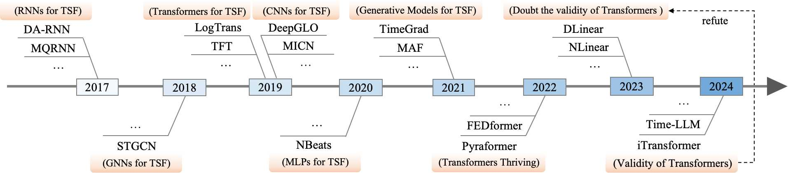
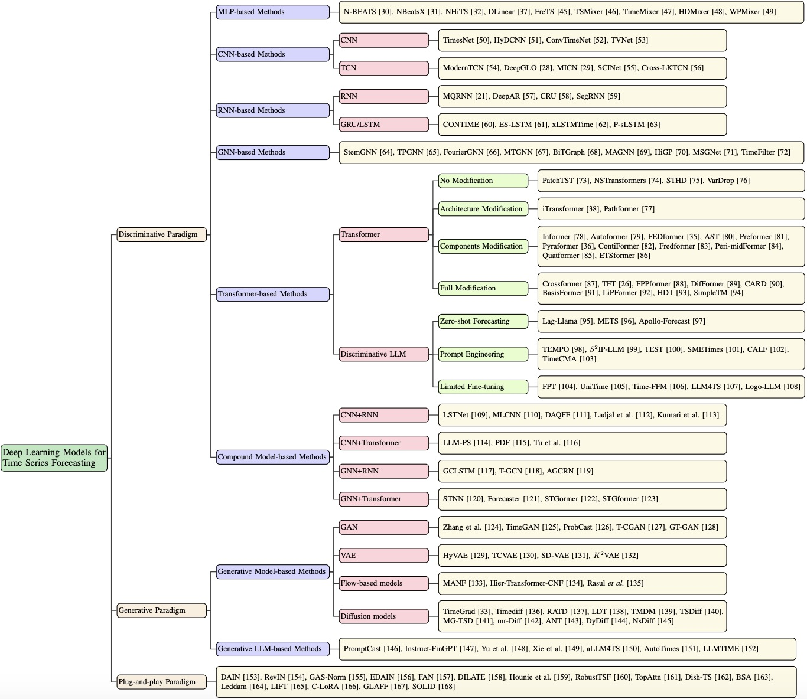

# A Survey of Deep Learning for Time Series Forecasting

  

🚩 2017: Recurrent neural networks ([RNNs](https://www.sciencedirect.com/science/article/abs/pii/036402139090002E)), such as [DA-RNN](https://www.ijcai.org/proceedings/2017/0366.pdf) and [MQRNN](https://arxiv.org/pdf/1711.11053), emerged as the dominant approach, marking the beginning of rapid advancement of deep learning in TSF.

🚩 2018: Data in various fields exhibit both spatial and temporal dependencies, and graph neural networks (GNNs)\cite{gnn} have introduced novel perspectives for spatiotemporal modeling, with STGCN\cite{stgcn} widely adopted as a benchmark. 

🚩 2019: Transformer-based models \cite{transformer}, such as LogTrans~\cite{logtrans} and TFT~\cite{tft}, have gained popularity due to their strength in modeling global dependencies. Concurrently, convolutional neural networks (CNNs) \cite{cnn} (e.g., DeepGLO~\cite{deepglo}, MICN~\cite{micn}) were employed in TSF, leveraging their parallelism, parameter sharing, and local perception capabilities. 

🚩 2020: Multi-layer perceptrons (MLPs), due to their simple architecture and ease of implementation, have been widely applied in TSF. A representative example is N-BEATS~\cite{n-beats}, which inspired a series of follow-up variants such as NBEATSx~\cite{nbeatsx} and N-HiTS~\cite{nhits}.

🚩 2021: Given that time series forecasting can essentially be regarded as a generative task, some generative approaches, such as TimeGrad~\cite{timegrad} and MAF~\cite{maf}, model the underlying data distribution to generate future sequences. 

🚩 2022: The Transformer architecture has undergone continuous development in recent years, giving rise to numerous studies, including FEDformer~\cite{fedformer} and Pyraformer~\cite{pyraformer}. 

🚩 2023: DLinear~\cite{dlinear}, a model based purely on MLPs, argued that Transformers are not necessarily superior in TSF and asserted that linear neural networks might be equally effective. 

🚩 2024: iTransformer~\cite{itransformer} demonstrated the effectiveness of the Transformer architecture through structural optimization, providing a strong rebuttal to DLinear's claims. Furthermore, the rapid proliferation of methods based on large language models (LLMs), such as Time-LLM~\cite{time-llm}, provides further evidence for the feasibility of Transformers in TSF.

  

📍 We provide a systematic review of deep learning-based TSF methods, summarizing recent advancements.  Specifically, we propose **a novel taxonomy based on core modeling paradigms**, which categorizes existing methods into three paradigms: **discriminative, generative, and plug-and-play**. Additionally, we summarize commonly used datasets and evaluation metrics, and discuss current challenges and future research directions in this field.

🚀 For a deeper dive, please check out our survey paper: **A Survey of Deep Learning for Time Series Forecasting: Taxonomy, Analysis, and Future Directions** 

## 📑 Table of Contents
- 🤖[A Survey of Deep Learning for Time Series Forecasting](#a-survey-of-deep-learning-for-time-series-forecasting)
  - 📑[Table of Contents](#-table-of-contents)
  - 📖[Taxonomy](#-taxonomy)
    - 📊[Discriminative Paradigm](#-discriminative-paradigm)
      - [2D Representations](#2d-representations)
      - [3D Representations](#3d-representations)
      - [Heterogeneous Data](#heterogeneous-data)
    - 🧠[Model Architecture](#-model-architecture)
      - [Large Language Model Based Diffusion Policy](#large-language-model-based-diffusion-policy)
      - [Small Size CNN or Transformer Model Based Diffusion Policy](#small-size-cnn-or-transformer-model-based-diffusion-policy)
      - [VAE / VQ-VAE Based Diffusion Policy](#vae--vq-vae-based-diffusion-policy)
    - 🌊[Diffusion Strategy](#-diffusion-strategy)
      - [Incorporating Reinforcement Learning](#incorporating-reinforcement-learning)
      - [Combined with Equivariance](#combined-with-equivariance)
      - [Accelerated Sampling or Denoising Strategies](#accelerated-sampling-or-denoising-strategies)
      - [Employing Classifier (free) Guidance](#employing-classifier-free-guidance)
      - [Integration with Self-Supervised Learning](#integration-with-self-supervised-learning)

##  📖 Taxonomy
### 📊 Discriminative Paradigm

#### 2D Representations

- **LATENT ACTION PRETRAINING FROM VIDEOS**, ICLR 2025. [[paper](https://arxiv.org/abs/2410.11758)] [[code](https://github.com/LatentActionPretraining/LAPA)] [[website](https://latentactionpretraining.github.io/)]
- **Diffusion Policy Policy Optimization**, ICLR 2025. [[paper](https://arxiv.org/abs/2409.00588)] [[code](https://github.com/irom-princeton/dppo)] [[website](https://diffusion-ppo.github.io/)]
- **Human2Robot: Learning Robot Actions from Paired Human-Robot Videos**, arXiv 2025. [[paper](https://arxiv.org/abs/2502.16587)]
- **Mitigating the Human-Robot Domain Discrepancy in Visual Pre-training for Robotic Manipulation**, CVPR 2025. [[paper](https://arxiv.org/abs/2406.14235)] [[website](https://jiaming-zhou.github.io/projects/HumanRobotAlign/)]
- **Point Policy: Unifying Observations and Actions with Key Points for Robot Manipulation**, arXiv 2025. [[paper](https://arxiv.org/abs/2502.20391)] [[code](https://github.com/siddhanthaldar/Point-Policy)] [[website](https://point-policy.github.io/)]
- **RDT-1B: a Diffusion Foundation Model for Bimanual Manipulation**, arXiv 2025. [[paper](https://arxiv.org/abs/2410.07864)] [[code](https://github.com/thu-ml/RoboticsDiffusionTransformer)] [[website](https://rdt-robotics.github.io/rdt-robotics/)]
- **MTDP: Modulated Transformer Diffusion Policy Model**, arXiv 2025. [[paper](https://arxiv.org/abs/2502.09029)]
- **S²-Diffusion: Generalizing from Instance-level to Category-level Skills in Robot Manipulation**, arXiv 2025. [[paper](https://arxiv.org/abs/2502.09389)] 
- **GEVRM：Goal-Expressive Video Generation Model For Robust Visual Manipulation**, ICLR 2025. [[paper](https://arxiv.org/abs/2502.09268)]
- **Diffusion Trajectory-guided Policy for Long-horizon Robot Manipulation**, arXiv 2025. [[paper](https://arxiv.org/abs/2502.10040)]
- **Reflective Planning: Vision-Language Models for Multi-Stage Long-Horizon Robotic Manipulation**, arXiv 2025. [[paper](https://arxiv.org/abs/2502.16707)] [[code](https://github.com/yunhaif/reflect-vlm)] [[website](https://reflect-vlm.github.io/)]

- **The Ingredients for Robotic Diffusion Transformers**, ICRA 2025. [[paper](https://arxiv.org/abs/2410.10088)] [[code](https://github.com/sudeepdasari/dit-policy)] [[website](https://dit-policy.github.io/)]

- **Imit Diff: Semantics Guided Diffusion Transformer with Dual Resolution Fusion for Imitation Learning**, arXiv 2025. [[paper](https://arxiv.org/abs/2502.09649)]

- **Learning an Actionable Discrete Diffusion Policy via Large-Scale Actionless Video Pre-Training**, NeurIPS 2024. [[paper](https://arxiv.org/abs/2402.14407)] [[code](https://github.com/tinnerhrhe/VPDD)] [[website](https://video-diff.github.io/)]

- **Dynamics-Guided Diffusion Model for Sensor-less Robot Manipulator Design**, CoRL 2024. [[paper](https://arxiv.org/abs/2402.15038)] [[code](https://github.com/real-stanford/dgdm)] [[website](https://dgdm-robot.github.io/)]

- **Octo: An Open-Source Generalist Robot Policy**, RSS 2024. [[paper](https://arxiv.org/abs/2405.12213)] [[code](https://github.com/octo-models/octo)] [[website](https://octo-models.github.io/)]

- **Learning to Manipulate Anywhere: A Visual Generalizable Framework For Reinforcement Learning**, CoRL 2024. [[paper](https://arxiv.org/abs/2407.15815)] [[code](https://github.com/gemcollector/maniwhere)] [[website](https://maniwhere.github.io/)]

- **DiffuserLite: Towards Real-time Diffusion Planning**, NeurIPS 2024. [[paper](https://arxiv.org/abs/2401.15443)] [[code](https://github.com/diffuserlite/diffuserlite.github.io)] [[website](https://diffuserlite.github.io/)]

- **Hierarchical Diffusion Policy for Kinematics-Aware Multi-Task Robotic Manipulation**, CVPR 2024. [[paper](https://arxiv.org/abs/2403.03890)] [[code](https://github.com/dyson-ai/hdp)] [[website](https://yusufma03.github.io/projects/hdp/)]
- **Diffusion Policy for Collision Avoidance in a Two-Arm Robot Setup**, ETH RC 2024. [[paper](https://www.research-collection.ethz.ch/handle/20.500.11850/675013)] 
- **Plan Diffuser: Grounding LLM Planners with Diffusion Models for Robotic Manipulation**, CRL_WS 2024. [[paper](https://openreview.net/forum?id=2a3sgm5YeX)]
- **ReorientDiff: Diffusion Model based Reorientation for Object Manipulation**, ICRA 2024. [[paper](https://arxiv.org/abs/2303.12700)] [[code](https://github.com/UtkarshMishra04/ReorientDiff)] [[website](https://umishra.me/ReorientDiff/)]
- **SkillDiffuser: Interpretable Hierarchical Planning via Skill Abstractions in Diffusion-Based Task Execution**, CVPR 2024. [[paper](https://arxiv.org/abs/2312.11598)] [[code](https://github.com/Liang-ZX/SkillDiffuser)] [[website](https://skilldiffuser.github.io/)]
- **ALDM-Grasping: Diffusion-aided Zero-Shot Sim-to-Real Transfer for Robot Grasping**, IROS 2024. [[paper](https://arxiv.org/abs/2403.11459)] [[code](https://github.com/levyisthebest/ALDM-grasping)]

- **Crossway Diffusion: Improving Diffusion-based Visuomotor Policy via Self-supervised Learning**, ICRA 2024. [[paper](https://arxiv.org/abs/2307.01849)] [[code](https://github.com/LostXine/crossway_diffusion)]
- **Diffusion Reward: Learning Rewards via Conditional Video Diffusion**, ECCV 2024. [[paper](https://arxiv.org/abs/2312.14134)] [[code](https://github.com/TEA-Lab/diffusion_reward)] [[website](https://diffusion-reward.github.io/)]

- **EDGI: Equivariant Diffusion for Planning with Embodied Agents**, NeurIPS 2023. [[paper](https://arxiv.org/abs/2303.12410)]
- **Diffusion Policy: Visuomotor Policy Learning via Action Diffusion**, arXiv 2023. [[paper](https://arxiv.org/abs/2303.04137)] [[code](https://github.com/real-stanford/diffusion_policy)] [[website](https://diffusion-policy.cs.columbia.edu/)]

- **Learning Universal Policies via Text-Guided Video Generation**, NeurIPS 2023. [[paper](https://arxiv.org/abs/2302.00111)]
- **GenAug: Retargeting behaviors to unseen situations via Generative Augmentation**, RSS 2023. [[paper](https://arxiv.org/abs/2302.06671)] [[code](https://github.com/genaug)] [[website](https://genaug.github.io/)]
- **AdaptDiffuser: Diffusion Models as Adaptive Self-evolving Planners**, ICML 2023. [[paper](https://arxiv.org/abs/2302.01877)]
- **Motion Planning Diffusion: Learning and Planning of Robot Motions with Diffusion Models**, IROS 2023. [[paper](https://arxiv.org/abs/2308.01557)] [[code](https://github.com/jacarvalho/mpd-public)] [[website](https://sites.google.com/view/mp-diffusion)]
- **Scaling Robot Learning with Semantically Imagined Experience**, RSS 2023. [[paper](https://arxiv.org/abs/2302.11550)]
- **Diffusion Model is an Effective Planner and Data Synthesizer for Multi-Task Reinforcement Learning**, arXiv 2023. [[paper](https://arxiv.org/abs/2305.18459)] [[code](https://github.com/tinnerhrhe/MTDiff)]
- **Planning with Diffusion for Flexible Behavior Synthesis**, ICML 2022. [[paper](https://arxiv.org/abs/2205.09991)] [[code](https://github.com/jannerm/diffuser)] [[website](https://diffusion-planning.github.io/)]

#### Heterogeneous Data
- **RDT-1B: a Diffusion Foundation Model for Bimanual Manipulation**, arXiv 2025. [[paper](https://arxiv.org/abs/2410.07864)] [[code](https://github.com/thu-ml/RoboticsDiffusionTransformer)] [[website](https://rdt-robotics.github.io/rdt-robotics/)]
- **Universal Actions for Enhanced Embodied Foundation Models**, arXiv 2025. [[paper](https://arxiv.org/abs/2501.10105)] [[code](https://github.com/2toinf/UniAct)] [[website](https://2toinf.github.io/UniAct/)]
- **Scaling Proprioceptive-Visual Learning with Heterogeneous Pre-trained Transformers**, NeurIPS 2024. [[paper](https://arxiv.org/abs/2409.20537)] [[code](https://github.com/liruiw/HPT)] [[website](https://liruiw.github.io/hpt/)]
- **PoCo: Policy Composition from and for Heterogeneous Robot Learning**, RSS 2024. [[paper](https://arxiv.org/abs/2402.02511)]

- **Π0: A Vision-Language-Action Flow Model for General Robot Control**, arXiv 2024. [[paper](https://arxiv.org/abs/2410.24164)]

#### 3D Representations
- **ADAMANIP: ADAPTIVE ARTICULATED OBJECT MANIPULATION ENVIRONMENTS AND POLICY LEARNING**, ICLR 2025. [[paper](https://arxiv.org/abs/2502.11124)]

- **GenDP: 3D Semantic Fields for Category-Level Generalizable Diffusion Policy**, CoRL 2024. [[paper](https://arxiv.org/abs/2410.17488)] [[code](https://github.com/WangYixuan12/gild)]
- **Generalizable Humanoid Manipulation with Improved 3D Diffusion Policies**, arXiv 2024. [[paper](https://arxiv.org/abs/2410.10803)] [[code](https://github.com/YanjieZe/Improved-3D-Diffusion-Policy)]
- **3D Diffusion Policy**, RSS 2024. [[paper](https://arxiv.org/abs/2403.03954)] [[code](https://github.com/YanjieZe/3D-Diffusion-Policy)] [[website](https://3d-diffusion-policy.github.io/)]
- **3D Diffuser Actor: Policy Diffusion with 3D Scene Representations**, CoRL 2024. [[paper](https://arxiv.org/abs/2402.10885)] [[code](https://github.com/nickgkan/3d_diffuser_actor)] [[website](https://3d-diffuser-actor.github.io/?utm_source=chatgpt.com)]

- **DexGrasp-Diffusion: Diffusion-based Unified Functional Grasp Synthesis Method for Multi-Dexterous Robotic Hands**, arXiv 2024. [[paper](https://arxiv.org/abs/2407.09899)]
- **DexDiffuser: Generating Dexterous Grasps with Diffusion Models**, arXiv 2024. [[paper](https://arxiv.org/abs/2402.02989)] [[code](https://github.com/YuLiHN/DexDiffuser)] [[website](https://yulihn.github.io/DexDiffuser_page/)]
- **ManiCM: Real-time 3D Diffusion Policy via Consistency Model for Robotic Manipulation**, arXiv 2024. [[paper](https://arxiv.org/abs/2406.01586)] [[code](https://github.com/ManiCM-fast/ManiCM)] [[website](https://manicm-fast.github.io/)]
- **Hierarchical Diffusion Policy for Kinematics-Aware Multi-Task Robotic Manipulation**, CVPR 2024. [[paper](https://arxiv.org/abs/2403.03890)] [[code](https://github.com/dyson-ai/hdp)] [[website](https://yusufma03.github.io/projects/hdp/)]
- **DNAct: Diffusion Guided Multi-Task 3D Policy Learning**, arXiv 2024. [[paper](https://arxiv.org/abs/2403.04115)]
- **EquiBot: SIM(3)-Equivariant Diffusion Policy for Generalizable and Data Efficient Learning**, CoRL 2024. [[paper](https://arxiv.org/abs/2407.01479)] [[code](https://github.com/yjy0625/equibot)] [[website](https://equi-bot.github.io/)]

- **RoboKeyGen: Robot Pose and Joint Angles Estimation via Diffusion-based 3D Keypoint Generation**, ICRA 2024. [[paper](https://arxiv.org/abs/2403.18259)] [[code](https://github.com/Nimolty/RoboKeyGen)] [[website](https://nimolty.github.io/Robokeygen/)]
- **Bi3D Diffuser Actor: 3D Policy Diffusion for Bi-manual Robot Manipulation**, CoRL Workshop 2024. [[paper](https://openreview.net/forum?id=xcBz0l6yfa)]

- **ChainedDiffuser: Unifying Trajectory Diffusion and Keypose Prediction for Robotic Manipulation**, CoRL 2023. [[code](https://github.com/zhouxian/act3d-chained-diffuser)]
- **EQUIVARIANT DESCRIPTION FIELDS: SE(3)-EQUIVARIANT ENERGY-BASED MODELS FOR END-TO-END VISUAL ROBOTIC MANIPULATION LEARNING**, ICLR 2023. [[paper](https://arxiv.org/abs/2206.08321)] [[code](https://github.com/tomato1mule/edf)]
- **Shelving, Stacking, Hanging: Relational Pose Diffusion for Multi-modal Rearrangement**, CoRL 2023. [[paper](https://arxiv.org/abs/2307.04751)] [[code](https://github.com/anthonysimeonov/rpdiff)] [[website](https://anthonysimeonov.github.io/rpdiff-multi-modal/)]
- **StructDiffusion: Object-Centric Diffusion for Semantic Rearrangement of Novel Objects**, RSS 2023. [[paper](https://arxiv.org/abs/2211.04604)] [[code](https://github.com/StructDiffusion/StructDiffusion)] [[website](https://www.weiyuliu.com/StructDiffusion/)]

 ### 🧠 Model Architecture

#### Large Language Model Based Diffusion Policy
- **ChatVLA: Unified Multimodal Understanding and Robot Control with Vision-Language-Action Model**, arXiv  2025. [[paper](https://arxiv.org/abs/2502.14420)]
- **RDT-1B: a Diffusion Foundation Model for Bimanual Manipulation**, arXiv 2025. [[paper](https://arxiv.org/abs/2410.07864)] [[code](https://github.com/thu-ml/RoboticsDiffusionTransformer)] [[website](https://rdt-robotics.github.io/rdt-robotics/)]

- **TinyVLA: Towards Fast, Data-Efficient Vision-Language-Action Models for Robotic Manipulation**, arXiv 2025. [[paper](https://arxiv.org/abs/2409.12514)]
- **LATENT ACTION PRETRAINING FROM VIDEOS**, ICLR 2025. [[paper](https://arxiv.org/abs/2410.11758)] [[code](https://github.com/LatentActionPretraining/LAPA)] [[website](https://latentactionpretraining.github.io/)]
- **DemoGen: Synthetic Demonstration Generation for Data-Efficient Visuomotor Policy Learning**, arXiv 2025. [[paper](https://arxiv.org/abs/2502.16932)]

- **Multimodal Diffusion Transformer: Learning Versatile Behavior from Multimodal Goals**, RSS 2024. [[paper](https://arxiv.org/abs/2407.05996)] [[code](https://github.com/intuitive-robots/mdt_policy)] [[website](https://intuitive-robots.github.io/mdt_policy/)]

- **Diffusion-VLA: Scaling Robot Foundation Models via Unified Diffusion and Autoregression**, arXiv 2024. [[paper](https://arxiv.org/abs/2412.03293)]

- **Octo: An Open-Source Generalist Robot Policy**, RSS 2024. [[paper](https://arxiv.org/abs/2405.12213)] [[code](https://github.com/octo-models/octo)] [[website](https://octo-models.github.io/)]

- **Π0: A Vision-Language-Action Flow Model for General Robot Control**, arXiv 2024. [[paper](https://arxiv.org/abs/2410.24164)]
- **Plan Diffuser: Grounding LLM Planners with Diffusion Models for Robotic Manipulation**, CRL_WS 2024. [[paper](https://openreview.net/forum?id=2a3sgm5YeX)]
- **Scaling Robot Learning with Semantically Imagined Experience**, RSS 2023. [[paper](https://arxiv.org/abs/2302.11550)]

- **Compositional Foundation Models for Hierarchical Planning**, NeurIPS 2023. [[paper](https://arxiv.org/abs/2309.08587)] [[code](https://github.com/anuragajay/hip)] [[website](https://hierarchical-planning-foundation-model.github.io/)]

#### Small Size CNN or Transformer Model Based Diffusion Policy

- **S²-Diffusion: Generalizing from Instance-level to Category-level Skills in Robot Manipulation**, arXiv 2025. [[paper](https://arxiv.org/abs/2502.09389)] 
- **Diffusion Trajectory-guided Policy for Long-horizon Robot Manipulation**, arXiv 2025. [[paper](https://arxiv.org/abs/2502.10040)]
- **The Ingredients for Robotic Diffusion Transformers**, ICRA 2025. [[paper](https://arxiv.org/abs/2410.10088)] [[code](https://github.com/sudeepdasari/dit-policy)] [[website](https://dit-policy.github.io/)]
- **MTDP: Modulated Transformer Diffusion Policy Model**, arXiv 2025. [[paper](https://arxiv.org/abs/2502.09029)]

- **Reflective Planning: Vision-Language Models for Multi-Stage Long-Horizon Robotic Manipulation**, arXiv 2025. [[paper](https://arxiv.org/abs/2502.16707)] [[code](https://github.com/yunhaif/reflect-vlm)] [[website](https://reflect-vlm.github.io/)]
- **ALOHA Unleashed: a transformer-based learning architecture trained with a diffusion loss**, CoRL 2024. [[paper](https://arxiv.org/abs/2410.13126)] [[code](https://github.com/aloha-unleashed/aloha_unleashed)] [[website](https://aloha-unleashed.github.io/)]

- **Diffusion Policy for Collision Avoidance in a Two-Arm Robot Setup**, ETH RC 2024. [[paper](https://www.research-collection.ethz.ch/handle/20.500.11850/675013)] 

- **3D Diffusion Policy**, RSS 2024. [[paper](https://arxiv.org/abs/2403.03954)] [[code](https://github.com/YanjieZe/3D-Diffusion-Policy)] [[website](https://3d-diffusion-policy.github.io/)]

- **3D Diffuser Actor: Policy Diffusion with 3D Scene Representations**, CoRL 2024. [[paper](https://arxiv.org/abs/2402.10885)] [[code](https://github.com/nickgkan/3d_diffuser_actor)] [[website](https://3d-diffuser-actor.github.io/?utm_source=chatgpt.com)]

- **Diffusion Model-Augmented Behavioral Cloning**, ICML 2024. [[paper](https://arxiv.org/abs/2302.13335)] [[code](https://github.com/NTURobotLearningLab/dbc)] [[website](https://nturobotlearninglab.github.io/DBC/)]

- **C3DM: Constrained-Context Conditional Diffusion Models for Imitation Learning**, TMLR 2024. [[paper](https://arxiv.org/abs/2311.01419)] [[website](https://sites.google.com/view/c3dm-imitation-learning)]

- **Render and Diffuse: Aligning Image and Action Spaces for Diffusion-based Behaviour Cloning**, RSS 2024. [[paper](https://arxiv.org/abs/2405.18196)] [[code](https://github.com/vv19/rendiff)] [[website](https://vv19.github.io/render-and-diffuse/)]

- **Hierarchical Diffusion Policy for Kinematics-Aware Multi-Task Robotic Manipulation**, CVPR 2024. [[paper](https://arxiv.org/abs/2403.03890)] [[code](https://github.com/dyson-ai/hdp)] [[website](https://yusufma03.github.io/projects/hdp/)]

- **DexGrasp-Diffusion: Diffusion-based Unified Functional Grasp Synthesis Method for Multi-Dexterous Robotic Hands**, arXiv 2024. [[paper](https://arxiv.org/abs/2407.09899)] 
- **DexDiffuser: Generating Dexterous Grasps with Diffusion Models**, arXiv 2024. [[paper](https://arxiv.org/abs/2402.02989)] [[code](https://github.com/YuLiHN/DexDiffuser)] [[website](https://yulihn.github.io/DexDiffuser_page/)]
- **Sparse Diffusion Policy: A Sparse, Reusable, and Flexible Policy for Robot Learning**, CoRL 2024. [[paper](https://arxiv.org/abs/2407.01531)] [[code](https://github.com/AnthonyHuo/SDP)]

- **Generate Subgoal Images before Act: Unlocking the Chain-of-Thought Reasoning in Diffusion Model for Robot Manipulation with Multi-modal Prompts**, CVPR 2024. [[paper](https://arxiv.org/abs/2310.09676)]

- **Subgoal Diffuser: Coarse-to-fine Subgoal Generation to Guide Model Predictive Control for Robot Manipulation**, ICRA 2024. [[paper](https://arxiv.org/abs/2403.13085)]
- **ZERO-SHOT ROBOTIC MANIPULATION WITH PRETRAINED IMAGE-EDITING DIFFUSION MODELS**, ICLR 2024. [[paper](https://arxiv.org/abs/2310.10639)] [[code](https://github.com/kvablack/susie)]
- **JUICER: Data-Efficient Imitation Learning for Robotic Assembly**, IROS 2024. [[paper](https://arxiv.org/abs/2404.03729)]
- **ALDM-Grasping: Diffusion-aided Zero-Shot Sim-to-Real Transfer for Robot Grasping**, IROS 2024. [[paper](https://arxiv.org/abs/2403.11459)] [[code](https://github.com/levyisthebest/ALDM-grasping)]
- **Scaling Robot Learning with Semantically Imagined Experience**, RSS 2023. [[paper](https://arxiv.org/abs/2302.11550)]
- **GenAug: Retargeting behaviors to unseen situations via Generative Augmentation**, RSS 2023. [[paper](https://arxiv.org/abs/2302.06671)] [[code](https://github.com/genaug)] [[website](https://genaug.github.io/)]
- **Learning Universal Policies via Text-Guided Video Generation**, NeurIPS 2023. [[paper](https://arxiv.org/abs/2302.00111)]

- **AdaptDiffuser: Diffusion Models as Adaptive Self-evolving Planners**, ICML 2023. [[paper](https://arxiv.org/abs/2302.01877)]

- **StructDiffusion: Object-Centric Diffusion for Semantic Rearrangement of Novel Objects**, RSS 2023. [[paper](https://arxiv.org/abs/2211.04604)] [[code](https://github.com/StructDiffusion/StructDiffusion)] [[website](https://www.weiyuliu.com/StructDiffusion/)]
- **DALL-E-Bot: Introducing Web-Scale Diffusion Models to Robotics**, PRL 2022. [[paper](https://arxiv.org/abs/2210.02438)]
- **ChainedDiffuser: Unifying Trajectory Diffusion and Keypose Prediction for Robotic Manipulation**, CoRL 2023. [[code](https://github.com/zhouxian/act3d-chained-diffuser)]
- **Scaling Up and Distilling Down: Language-Guided Robot Skill Acquisition**, CoRL 2023. [[paper](https://arxiv.org/abs/2307.14535)] [[code](https://github.com/real-stanford/scalingup)]
- **Motion Planning Diffusion: Learning and Planning of Robot Motions with Diffusion Models**, IROS 2023. [[paper](https://arxiv.org/abs/2308.01557)] [[code](https://github.com/jacarvalho/mpd-public)] [[website](https://sites.google.com/view/mp-diffusion)]
- **Generative Skill Chaining: Long-Horizon Skill Planning with Diffusion Models**, CoRL 2023. [[paper](https://arxiv.org/abs/2401.03360)] [[code](https://github.com/generative-skill-chaining/gsc-code)]
- **PlayFusion: Skill Acquisition via Diffusion from Language-Annotated Play**, CoRL 2023. [[paper](https://arxiv.org/abs/2312.04549)] [[code](https://github.com/shikharbahl/playfusion_dataset)]
- **Diffusion Policy: Visuomotor Policy Learning via Action Diffusion**, arXiv 2023. [[paper](https://arxiv.org/abs/2303.04137)] [[code](https://github.com/real-stanford/diffusion_policy)] [[website](https://diffusion-policy.cs.columbia.edu/)]

- **SE(3)-DiffusionFields: Learning smooth cost functions for joint grasp and motion optimization through diffusion**, ICRA 2023. [[paper](https://arxiv.org/abs/2209.03855)] [[code](https://github.com/robotgradient/grasp_diffusion)]

- **CACTI: A Framework for Scalable Multi-Task Multi-Scene Visual Imitation Learning**, PRL 2022. [[paper](https://arxiv.org/abs/2212.05711)] [[code](https://github.com/cacti-framework/cacti-framework.github.io)]
- **Planning with Diffusion for Flexible Behavior Synthesis**, ICML 2022. [[paper](https://arxiv.org/abs/2205.09991)] [[code](https://github.com/jannerm/diffuser)] [[website](https://diffusion-planning.github.io/)]

#### VAE / VQ-VAE Based Diffusion Policy

- **LATENT ACTION PRETRAINING FROM VIDEOS**, ICLR 2025. [[paper](https://arxiv.org/abs/2410.11758)] [[code](https://github.com/LatentActionPretraining/LAPA)] [[website](https://latentactionpretraining.github.io/)]
- **Universal Actions for Enhanced Embodied Foundation Models**, arXiv 2025. [[paper](https://arxiv.org/abs/2501.10105)] [[code](https://github.com/2toinf/UniAct)] [[website](https://2toinf.github.io/UniAct/)]
- **GEVRM：Goal-Expressive Video Generation Model For Robust Visual Manipulation**, ICLR 2025. [[paper](https://arxiv.org/abs/2502.09268)]
- **Discrete Policy: Learning Disentangled Action Space for Multi-Task Robotic Manipulation**, ICRA 2025. [[paper](https://arxiv.org/abs/2409.18707)]
- **Learning an Actionable Discrete Diffusion Policy via Large-Scale Actionless Video Pre-Training**, NeurIPS 2024. [[paper](https://arxiv.org/abs/2402.14407)] [[code](https://github.com/tinnerhrhe/VPDD)] [[website](https://video-diff.github.io/)]

### 🌊 Diffusion Strategy

#### Incorporating Reinforcement Learning

- **Diffusion Policy Policy Optimization**, ICLR 2025. [[paper](https://arxiv.org/abs/2409.00588)] [[code](https://github.com/irom-princeton/dppo)] [[website](https://diffusion-ppo.github.io/)]
- **Diffusion Reward: Learning Rewards via Conditional Video Diffusion**, ECCV 2024. [[paper](https://arxiv.org/abs/2312.14134)] [[code](https://github.com/TEA-Lab/diffusion_reward)] [[website](https://diffusion-reward.github.io/)]

- **Reasoning with Latent Diffusion in Offline Reinforcement Learning**, ICLR 2024. [[paper](https://arxiv.org/abs/2309.06599)]

- **Learning a Diffusion Model Policy from Rewards via Q-Score Matching**, ICML 2024. [[paper](https://arxiv.org/abs/2312.11752)] [[code](https://github.com/Alescontrela/score_matching_rl)]
- **Policy Representation via Diffusion Probability Model for Reinforcement Learning**, arXiv 2024. [[paper](https://arxiv.org/abs/2305.13122)]

- **Diffusion-ES: Gradient-free Planning with Diffusion for Autonomous Driving and Zero-Shot Instruction Following**, arXiv 2024. [[paper](https://arxiv.org/abs/2402.06559)] [[code](https://github.com/bhyang/diffusion-es)]
- **EDGI: Equivariant Diffusion for Planning with Embodied Agents**, NeurIPS 2023. [[paper](https://arxiv.org/abs/2303.12410)]
- **Efficient Diffusion Policies for Offline Reinforcement Learning**, NeurIPS 2023. [[paper](https://arxiv.org/abs/2305.20081)] [[code](https://github.com/sail-sg/edp)]
- **Diffusion Model is an Effective Planner and Data Synthesizer for Multi-Task Reinforcement Learning**, arXiv 2023. [[paper](https://arxiv.org/abs/2305.18459)] [[code](https://github.com/tinnerhrhe/MTDiff)]
- **Planning with Diffusion for Flexible Behavior Synthesis**, ICML 2022. [[paper](https://arxiv.org/abs/2205.09991)] [[code](https://github.com/jannerm/diffuser)] [[website](https://diffusion-planning.github.io/)]

#### Combined with Equivariance

- **Diffusion-EDFs: Bi-equivariant Denoising Generative Modeling on SE(3) for Visual Robotic Manipulation**, CVPR 2024. [[paper](https://arxiv.org/abs/2309.02685)] [[code](https://github.com/tomato1mule/diffusion_edf)]
- **EquiBot: SIM(3)-Equivariant Diffusion Policy for Generalizable and Data Efficient Learning**, CoRL 2024. [[paper](https://arxiv.org/abs/2407.01479)] [[code](https://github.com/yjy0625/equibot)] [[website](https://equi-bot.github.io/)]
- **EDGI: Equivariant Diffusion for Planning with Embodied Agents**, NeurIPS 2023. [[paper](https://arxiv.org/abs/2303.12410)]

#### Accelerated Sampling or Denoising Strategies
- **Diffusion Policy Policy Optimization**, ICLR 2025. [[paper](https://arxiv.org/abs/2409.00588)] [[code](https://github.com/irom-princeton/dppo)] [[website](https://diffusion-ppo.github.io/)]
- **Imit Diff: Semantics Guided Diffusion Transformer with Dual Resolution Fusion for Imitation Learning**, arXiv 2025. [[paper](https://arxiv.org/abs/2502.09649)]

- **ManiCM: Real-time 3D Diffusion Policy via Consistency Model for Robotic Manipulation**, arXiv 2024. [[paper](https://arxiv.org/abs/2406.01586)] [[code](https://github.com/ManiCM-fast/ManiCM)] [[website](https://manicm-fast.github.io/)]

- **DiffuserLite: Towards Real-time Diffusion Planning**, NeurIPS 2024. [[paper](https://arxiv.org/abs/2401.15443)] [[code](https://github.com/diffuserlite/diffuserlite.github.io)] [[website](https://diffuserlite.github.io/)]

- **Hierarchical Diffusion Policy for Kinematics-Aware Multi-Task Robotic Manipulation**, CVPR 2024. [[paper](https://arxiv.org/abs/2403.03890)] [[code](https://github.com/dyson-ai/hdp)] [[website](https://yusufma03.github.io/projects/hdp/)]
- **RoboKeyGen: Robot Pose and Joint Angles Estimation via Diffusion-based 3D Keypoint Generation**, ICRA 2024. [[paper](https://arxiv.org/abs/2403.18259)] [[code](https://github.com/Nimolty/RoboKeyGen)] [[website](https://nimolty.github.io/Robokeygen/)]
- **ReorientDiff: Diffusion Model based Reorientation for Object Manipulation**, ICRA 2024. [[paper](https://arxiv.org/abs/2303.12700)] [[code](https://github.com/UtkarshMishra04/ReorientDiff)] [[website](https://umishra.me/ReorientDiff/)]
- **Diff-DAgger: Uncertainty Estimation with Diffusion Policy for Robotic Manipulation**, CoRL 2024. [[paper](https://arxiv.org/abs/2410.14868)]
- **Π0: A Vision-Language-Action Flow Model for General Robot Control**, arXiv 2024. [[paper](https://arxiv.org/abs/2410.24164)]

- **IMITATING HUMAN BEHAVIOUR WITH DIFFUSION MODELS**, ICLR 2023. [[paper](https://arxiv.org/abs/2301.10677)] [[code](https://github.com/microsoft/Imitating-Human-Behaviour-w-Diffusion)]
- **Goal-Conditioned Imitation Learning using Score-based Diffusion Policies**, RSS 2023. [[paper](https://arxiv.org/abs/2304.02532)] [[code](https://github.com/intuitive-robots/beso)]
- **ChainedDiffuser: Unifying Trajectory Diffusion and Keypose Prediction for Robotic Manipulation**, CoRL 2023. [[code](https://github.com/zhouxian/act3d-chained-diffuser)]

#### Employing Classifier (free) Guidance

- **ReorientDiff: Diffusion Model based Reorientation for Object Manipulation**, ICRA 2024. [[paper](https://arxiv.org/abs/2303.12700)] [[code](https://github.com/UtkarshMishra04/ReorientDiff)] [[website](https://umishra.me/ReorientDiff/)]
- **Dynamics-Guided Diffusion Model for Sensor-less Robot Manipulator Design**, CoRL 2024. [[paper](https://arxiv.org/abs/2402.15038)] [[code](https://github.com/real-stanford/dgdm)] [[website](https://dgdm-robot.github.io/)]
- **SkillDiffuser: Interpretable Hierarchical Planning via Skill Abstractions in Diffusion-Based Task Execution**, CVPR 2024. [[paper](https://arxiv.org/abs/2312.11598)] [[code](https://github.com/Liang-ZX/SkillDiffuser)] [[website](https://skilldiffuser.github.io/)]
- **Goal-Conditioned Imitation Learning using Score-based Diffusion Policies**, RSS 2023. [[paper](https://arxiv.org/abs/2304.02532)] [[code](https://github.com/intuitive-robots/beso)]

- **Generative Skill Chaining: Long-Horizon Skill Planning with Diffusion Models**, CoRL 2023. [[paper](https://arxiv.org/abs/2401.03360)] [[code](https://github.com/generative-skill-chaining/gsc-code)]

#### Integration with Self-Supervised Learning

- **Multimodal Diffusion Transformer: Learning Versatile Behavior from Multimodal Goals**, RSS 2024. [[paper](https://arxiv.org/abs/2407.05996)] [[code](https://github.com/intuitive-robots/mdt_policy)] [[website](https://intuitive-robots.github.io/mdt_policy/)]
- **Crossway Diffusion: Improving Diffusion-based Visuomotor Policy via Self-supervised Learning**, ICRA 2024. [[paper](https://arxiv.org/abs/2307.01849)]

