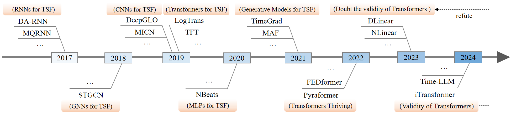

# A Survey on Diffusion Policy for Robotic Manipulation


<div style="text-align: center;">
  
</div>

🔥 Since 2022, research on diffusion policies for robotic manipulation has demonstrated consistently superior performance compared to traditional methodologies across diverse tasks. Despite the rapid growth and promising results in this field, there remains a notable absence of comprehensive survey literature that systematically analyzes and synthesizes developments in this evolving research field.

<table>
  <tr>
    <td>
      
    </td>
    <td>
      
    </td>
  </tr>
</table>


📍 We present **the first comprehensive analysis of diffusion policies for robotic manipulation**. Specifically, we systematically analyze existing methods from three perspectives: data representation, model architecture, and diffusion strategy. For example, from the model architecture perspective, we categorize existing diffusion policy methods into three types: (a) Large Language Model Based Diffusion Policy, (b) Small Size CNN or Transformer Based Diffusion Policy, and (c) VAE / VQ-VAE Based Diffusion Policy.

🚀 For a deeper dive, please check out our [survey paper](https://doi.org/10.36227/techrxiv.174378343.39356214/v1): **A Survey on Diffusion Policy for Robotic Manipulation: Taxonomy, Analysis, and Future Directions** 
## 📑 Table of Contents
- 🤖[A Survey on Diffusion Policy for Robotic Manipulation](#a-survey-on-diffusion-policy-for-robotic-manipulation)
  - 📑[Table of Contents](#-table-of-contents)
  - 📖[Papers](#-papers)
    - 📊[Data Representation](#-data-representation)
      - [2D Representations](#2d-representations)
      - [3D Representations](#3d-representations)
      - [Heterogeneous Data](#heterogeneous-data)
    - 🧠[Model Architecture](#-model-architecture)
      - [Large Language Model Based Diffusion Policy](#large-language-model-based-diffusion-policy)
      - [Small Size CNN or Transformer Model Based Diffusion Policy](#small-size-cnn-or-transformer-model-based-diffusion-policy)
      - [VAE / VQ-VAE Based Diffusion Policy](#vae--vq-vae-based-diffusion-policy)
    - 🌊[Diffusion Strategy](#-diffusion-strategy)
      - [Incorporating Reinforcement Learning](#incorporating-reinforcement-learning)
      - [Combined with Equivariance](#combined-with-equivariance)
      - [Accelerated Sampling or Denoising Strategies](#accelerated-sampling-or-denoising-strategies)
      - [Employing Classifier (free) Guidance](#employing-classifier-free-guidance)
      - [Integration with Self-Supervised Learning](#integration-with-self-supervised-learning)
  - 🦾[Simulation Platforms & Real-World Robots](#-simulation-platforms--real-world-robots)

  - 📜[Citation](#-citation)

##  📖 Papers
### 📊 Data Representation

#### 2D Representations

- **LATENT ACTION PRETRAINING FROM VIDEOS**, ICLR 2025. [[paper](https://arxiv.org/abs/2410.11758)] [[code](https://github.com/LatentActionPretraining/LAPA)] [[website](https://latentactionpretraining.github.io/)]
- **Diffusion Policy Policy Optimization**, ICLR 2025. [[paper](https://arxiv.org/abs/2409.00588)] [[code](https://github.com/irom-princeton/dppo)] [[website](https://diffusion-ppo.github.io/)]
- **Human2Robot: Learning Robot Actions from Paired Human-Robot Videos**, arXiv 2025. [[paper](https://arxiv.org/abs/2502.16587)]
- **Mitigating the Human-Robot Domain Discrepancy in Visual Pre-training for Robotic Manipulation**, CVPR 2025. [[paper](https://arxiv.org/abs/2406.14235)] [[website](https://jiaming-zhou.github.io/projects/HumanRobotAlign/)]
- **Point Policy: Unifying Observations and Actions with Key Points for Robot Manipulation**, arXiv 2025. [[paper](https://arxiv.org/abs/2502.20391)] [[code](https://github.com/siddhanthaldar/Point-Policy)] [[website](https://point-policy.github.io/)]
- **RDT-1B: a Diffusion Foundation Model for Bimanual Manipulation**, arXiv 2025. [[paper](https://arxiv.org/abs/2410.07864)] [[code](https://github.com/thu-ml/RoboticsDiffusionTransformer)] [[website](https://rdt-robotics.github.io/rdt-robotics/)]
- **MTDP: Modulated Transformer Diffusion Policy Model**, arXiv 2025. [[paper](https://arxiv.org/abs/2502.09029)]
- **S²-Diffusion: Generalizing from Instance-level to Category-level Skills in Robot Manipulation**, arXiv 2025. [[paper](https://arxiv.org/abs/2502.09389)] 
- **GEVRM：Goal-Expressive Video Generation Model For Robust Visual Manipulation**, ICLR 2025. [[paper](https://arxiv.org/abs/2502.09268)]
- **Diffusion Trajectory-guided Policy for Long-horizon Robot Manipulation**, arXiv 2025. [[paper](https://arxiv.org/abs/2502.10040)]
- **Reflective Planning: Vision-Language Models for Multi-Stage Long-Horizon Robotic Manipulation**, arXiv 2025. [[paper](https://arxiv.org/abs/2502.16707)] [[code](https://github.com/yunhaif/reflect-vlm)] [[website](https://reflect-vlm.github.io/)]

- **The Ingredients for Robotic Diffusion Transformers**, ICRA 2025. [[paper](https://arxiv.org/abs/2410.10088)] [[code](https://github.com/sudeepdasari/dit-policy)] [[website](https://dit-policy.github.io/)]

- **Imit Diff: Semantics Guided Diffusion Transformer with Dual Resolution Fusion for Imitation Learning**, arXiv 2025. [[paper](https://arxiv.org/abs/2502.09649)]

- **Learning an Actionable Discrete Diffusion Policy via Large-Scale Actionless Video Pre-Training**, NeurIPS 2024. [[paper](https://arxiv.org/abs/2402.14407)] [[code](https://github.com/tinnerhrhe/VPDD)] [[website](https://video-diff.github.io/)]

- **Dynamics-Guided Diffusion Model for Sensor-less Robot Manipulator Design**, CoRL 2024. [[paper](https://arxiv.org/abs/2402.15038)] [[code](https://github.com/real-stanford/dgdm)] [[website](https://dgdm-robot.github.io/)]


- **Octo: An Open-Source Generalist Robot Policy**, RSS 2024. [[paper](https://arxiv.org/abs/2405.12213)] [[code](https://github.com/octo-models/octo)] [[website](https://octo-models.github.io/)]

- **Learning to Manipulate Anywhere: A Visual Generalizable Framework For Reinforcement Learning**, CoRL 2024. [[paper](https://arxiv.org/abs/2407.15815)] [[code](https://github.com/gemcollector/maniwhere)] [[website](https://maniwhere.github.io/)]

- **DiffuserLite: Towards Real-time Diffusion Planning**, NeurIPS 2024. [[paper](https://arxiv.org/abs/2401.15443)] [[code](https://github.com/diffuserlite/diffuserlite.github.io)] [[website](https://diffuserlite.github.io/)]

- **Hierarchical Diffusion Policy for Kinematics-Aware Multi-Task Robotic Manipulation**, CVPR 2024. [[paper](https://arxiv.org/abs/2403.03890)] [[code](https://github.com/dyson-ai/hdp)] [[website](https://yusufma03.github.io/projects/hdp/)]
- **Diffusion Policy for Collision Avoidance in a Two-Arm Robot Setup**, ETH RC 2024. [[paper](https://www.research-collection.ethz.ch/handle/20.500.11850/675013)] 
- **Plan Diffuser: Grounding LLM Planners with Diffusion Models for Robotic Manipulation**, CRL_WS 2024. [[paper](https://openreview.net/forum?id=2a3sgm5YeX)]
- **ReorientDiff: Diffusion Model based Reorientation for Object Manipulation**, ICRA 2024. [[paper](https://arxiv.org/abs/2303.12700)] [[code](https://github.com/UtkarshMishra04/ReorientDiff)] [[website](https://umishra.me/ReorientDiff/)]
- **SkillDiffuser: Interpretable Hierarchical Planning via Skill Abstractions in Diffusion-Based Task Execution**, CVPR 2024. [[paper](https://arxiv.org/abs/2312.11598)] [[code](https://github.com/Liang-ZX/SkillDiffuser)] [[website](https://skilldiffuser.github.io/)]
- **ALDM-Grasping: Diffusion-aided Zero-Shot Sim-to-Real Transfer for Robot Grasping**, IROS 2024. [[paper](https://arxiv.org/abs/2403.11459)] [[code](https://github.com/levyisthebest/ALDM-grasping)]

- **Crossway Diffusion: Improving Diffusion-based Visuomotor Policy via Self-supervised Learning**, ICRA 2024. [[paper](https://arxiv.org/abs/2307.01849)] [[code](https://github.com/LostXine/crossway_diffusion)]
- **Diffusion Reward: Learning Rewards via Conditional Video Diffusion**, ECCV 2024. [[paper](https://arxiv.org/abs/2312.14134)] [[code](https://github.com/TEA-Lab/diffusion_reward)] [[website](https://diffusion-reward.github.io/)]

- **EDGI: Equivariant Diffusion for Planning with Embodied Agents**, NeurIPS 2023. [[paper](https://arxiv.org/abs/2303.12410)]
- **Diffusion Policy: Visuomotor Policy Learning via Action Diffusion**, arXiv 2023. [[paper](https://arxiv.org/abs/2303.04137)] [[code](https://github.com/real-stanford/diffusion_policy)] [[website](https://diffusion-policy.cs.columbia.edu/)]

- **Learning Universal Policies via Text-Guided Video Generation**, NeurIPS 2023. [[paper](https://arxiv.org/abs/2302.00111)]
- **GenAug: Retargeting behaviors to unseen situations via Generative Augmentation**, RSS 2023. [[paper](https://arxiv.org/abs/2302.06671)] [[code](https://github.com/genaug)] [[website](https://genaug.github.io/)]
- **AdaptDiffuser: Diffusion Models as Adaptive Self-evolving Planners**, ICML 2023. [[paper](https://arxiv.org/abs/2302.01877)]
- **Motion Planning Diffusion: Learning and Planning of Robot Motions with Diffusion Models**, IROS 2023. [[paper](https://arxiv.org/abs/2308.01557)] [[code](https://github.com/jacarvalho/mpd-public)] [[website](https://sites.google.com/view/mp-diffusion)]
- **Scaling Robot Learning with Semantically Imagined Experience**, RSS 2023. [[paper](https://arxiv.org/abs/2302.11550)]
- **Diffusion Model is an Effective Planner and Data Synthesizer for Multi-Task Reinforcement Learning**, arXiv 2023. [[paper](https://arxiv.org/abs/2305.18459)] [[code](https://github.com/tinnerhrhe/MTDiff)]
- **Planning with Diffusion for Flexible Behavior Synthesis**, ICML 2022. [[paper](https://arxiv.org/abs/2205.09991)] [[code](https://github.com/jannerm/diffuser)] [[website](https://diffusion-planning.github.io/)]


#### Heterogeneous Data
- **RDT-1B: a Diffusion Foundation Model for Bimanual Manipulation**, arXiv 2025. [[paper](https://arxiv.org/abs/2410.07864)] [[code](https://github.com/thu-ml/RoboticsDiffusionTransformer)] [[website](https://rdt-robotics.github.io/rdt-robotics/)]
- **Universal Actions for Enhanced Embodied Foundation Models**, arXiv 2025. [[paper](https://arxiv.org/abs/2501.10105)] [[code](https://github.com/2toinf/UniAct)] [[website](https://2toinf.github.io/UniAct/)]
- **Scaling Proprioceptive-Visual Learning with Heterogeneous Pre-trained Transformers**, NeurIPS 2024. [[paper](https://arxiv.org/abs/2409.20537)] [[code](https://github.com/liruiw/HPT)] [[website](https://liruiw.github.io/hpt/)]
- **PoCo: Policy Composition from and for Heterogeneous Robot Learning**, RSS 2024. [[paper](https://arxiv.org/abs/2402.02511)]

- **Π0: A Vision-Language-Action Flow Model for General Robot Control**, arXiv 2024. [[paper](https://arxiv.org/abs/2410.24164)]


#### 3D Representations
- **ADAMANIP: ADAPTIVE ARTICULATED OBJECT MANIPULATION ENVIRONMENTS AND POLICY LEARNING**, ICLR 2025. [[paper](https://arxiv.org/abs/2502.11124)]

- **GenDP: 3D Semantic Fields for Category-Level Generalizable Diffusion Policy**, CoRL 2024. [[paper](https://arxiv.org/abs/2410.17488)] [[code](https://github.com/WangYixuan12/gild)]
- **Generalizable Humanoid Manipulation with Improved 3D Diffusion Policies**, arXiv 2024. [[paper](https://arxiv.org/abs/2410.10803)] [[code](https://github.com/YanjieZe/Improved-3D-Diffusion-Policy)]
- **3D Diffusion Policy**, RSS 2024. [[paper](https://arxiv.org/abs/2403.03954)] [[code](https://github.com/YanjieZe/3D-Diffusion-Policy)] [[website](https://3d-diffusion-policy.github.io/)]
- **3D Diffuser Actor: Policy Diffusion with 3D Scene Representations**, CoRL 2024. [[paper](https://arxiv.org/abs/2402.10885)] [[code](https://github.com/nickgkan/3d_diffuser_actor)] [[website](https://3d-diffuser-actor.github.io/?utm_source=chatgpt.com)]

- **DexGrasp-Diffusion: Diffusion-based Unified Functional Grasp Synthesis Method for Multi-Dexterous Robotic Hands**, arXiv 2024. [[paper](https://arxiv.org/abs/2407.09899)]
- **DexDiffuser: Generating Dexterous Grasps with Diffusion Models**, arXiv 2024. [[paper](https://arxiv.org/abs/2402.02989)] [[code](https://github.com/YuLiHN/DexDiffuser)] [[website](https://yulihn.github.io/DexDiffuser_page/)]
- **ManiCM: Real-time 3D Diffusion Policy via Consistency Model for Robotic Manipulation**, arXiv 2024. [[paper](https://arxiv.org/abs/2406.01586)] [[code](https://github.com/ManiCM-fast/ManiCM)] [[website](https://manicm-fast.github.io/)]
- **Hierarchical Diffusion Policy for Kinematics-Aware Multi-Task Robotic Manipulation**, CVPR 2024. [[paper](https://arxiv.org/abs/2403.03890)] [[code](https://github.com/dyson-ai/hdp)] [[website](https://yusufma03.github.io/projects/hdp/)]
- **DNAct: Diffusion Guided Multi-Task 3D Policy Learning**, arXiv 2024. [[paper](https://arxiv.org/abs/2403.04115)]
- **EquiBot: SIM(3)-Equivariant Diffusion Policy for Generalizable and Data Efficient Learning**, CoRL 2024. [[paper](https://arxiv.org/abs/2407.01479)] [[code](https://github.com/yjy0625/equibot)] [[website](https://equi-bot.github.io/)]

- **RoboKeyGen: Robot Pose and Joint Angles Estimation via Diffusion-based 3D Keypoint Generation**, ICRA 2024. [[paper](https://arxiv.org/abs/2403.18259)] [[code](https://github.com/Nimolty/RoboKeyGen)] [[website](https://nimolty.github.io/Robokeygen/)]
- **Bi3D Diffuser Actor: 3D Policy Diffusion for Bi-manual Robot Manipulation**, CoRL Workshop 2024. [[paper](https://openreview.net/forum?id=xcBz0l6yfa)]


- **ChainedDiffuser: Unifying Trajectory Diffusion and Keypose Prediction for Robotic Manipulation**, CoRL 2023. [[code](https://github.com/zhouxian/act3d-chained-diffuser)]
- **EQUIVARIANT DESCRIPTION FIELDS: SE(3)-EQUIVARIANT ENERGY-BASED MODELS FOR END-TO-END VISUAL ROBOTIC MANIPULATION LEARNING**, ICLR 2023. [[paper](https://arxiv.org/abs/2206.08321)] [[code](https://github.com/tomato1mule/edf)]
- **Shelving, Stacking, Hanging: Relational Pose Diffusion for Multi-modal Rearrangement**, CoRL 2023. [[paper](https://arxiv.org/abs/2307.04751)] [[code](https://github.com/anthonysimeonov/rpdiff)] [[website](https://anthonysimeonov.github.io/rpdiff-multi-modal/)]
- **StructDiffusion: Object-Centric Diffusion for Semantic Rearrangement of Novel Objects**, RSS 2023. [[paper](https://arxiv.org/abs/2211.04604)] [[code](https://github.com/StructDiffusion/StructDiffusion)] [[website](https://www.weiyuliu.com/StructDiffusion/)]


 ### 🧠 Model Architecture

#### Large Language Model Based Diffusion Policy
- **ChatVLA: Unified Multimodal Understanding and Robot Control with Vision-Language-Action Model**, arXiv  2025. [[paper](https://arxiv.org/abs/2502.14420)]
- **RDT-1B: a Diffusion Foundation Model for Bimanual Manipulation**, arXiv 2025. [[paper](https://arxiv.org/abs/2410.07864)] [[code](https://github.com/thu-ml/RoboticsDiffusionTransformer)] [[website](https://rdt-robotics.github.io/rdt-robotics/)]

- **TinyVLA: Towards Fast, Data-Efficient Vision-Language-Action Models for Robotic Manipulation**, arXiv 2025. [[paper](https://arxiv.org/abs/2409.12514)]
- **LATENT ACTION PRETRAINING FROM VIDEOS**, ICLR 2025. [[paper](https://arxiv.org/abs/2410.11758)] [[code](https://github.com/LatentActionPretraining/LAPA)] [[website](https://latentactionpretraining.github.io/)]
- **DemoGen: Synthetic Demonstration Generation for Data-Efficient Visuomotor Policy Learning**, arXiv 2025. [[paper](https://arxiv.org/abs/2502.16932)]


- **Multimodal Diffusion Transformer: Learning Versatile Behavior from Multimodal Goals**, RSS 2024. [[paper](https://arxiv.org/abs/2407.05996)] [[code](https://github.com/intuitive-robots/mdt_policy)] [[website](https://intuitive-robots.github.io/mdt_policy/)]


- **Diffusion-VLA: Scaling Robot Foundation Models via Unified Diffusion and Autoregression**, arXiv 2024. [[paper](https://arxiv.org/abs/2412.03293)]

- **Octo: An Open-Source Generalist Robot Policy**, RSS 2024. [[paper](https://arxiv.org/abs/2405.12213)] [[code](https://github.com/octo-models/octo)] [[website](https://octo-models.github.io/)]

- **Π0: A Vision-Language-Action Flow Model for General Robot Control**, arXiv 2024. [[paper](https://arxiv.org/abs/2410.24164)]
- **Plan Diffuser: Grounding LLM Planners with Diffusion Models for Robotic Manipulation**, CRL_WS 2024. [[paper](https://openreview.net/forum?id=2a3sgm5YeX)]
- **Scaling Robot Learning with Semantically Imagined Experience**, RSS 2023. [[paper](https://arxiv.org/abs/2302.11550)]

- **Compositional Foundation Models for Hierarchical Planning**, NeurIPS 2023. [[paper](https://arxiv.org/abs/2309.08587)] [[code](https://github.com/anuragajay/hip)] [[website](https://hierarchical-planning-foundation-model.github.io/)]

#### Small Size CNN or Transformer Model Based Diffusion Policy


- **S²-Diffusion: Generalizing from Instance-level to Category-level Skills in Robot Manipulation**, arXiv 2025. [[paper](https://arxiv.org/abs/2502.09389)] 
- **Diffusion Trajectory-guided Policy for Long-horizon Robot Manipulation**, arXiv 2025. [[paper](https://arxiv.org/abs/2502.10040)]
- **The Ingredients for Robotic Diffusion Transformers**, ICRA 2025. [[paper](https://arxiv.org/abs/2410.10088)] [[code](https://github.com/sudeepdasari/dit-policy)] [[website](https://dit-policy.github.io/)]
- **MTDP: Modulated Transformer Diffusion Policy Model**, arXiv 2025. [[paper](https://arxiv.org/abs/2502.09029)]

- **Reflective Planning: Vision-Language Models for Multi-Stage Long-Horizon Robotic Manipulation**, arXiv 2025. [[paper](https://arxiv.org/abs/2502.16707)] [[code](https://github.com/yunhaif/reflect-vlm)] [[website](https://reflect-vlm.github.io/)]
- **ALOHA Unleashed: a transformer-based learning architecture trained with a diffusion loss**, CoRL 2024. [[paper](https://arxiv.org/abs/2410.13126)] [[code](https://github.com/aloha-unleashed/aloha_unleashed)] [[website](https://aloha-unleashed.github.io/)]

- **Diffusion Policy for Collision Avoidance in a Two-Arm Robot Setup**, ETH RC 2024. [[paper](https://www.research-collection.ethz.ch/handle/20.500.11850/675013)] 


- **3D Diffusion Policy**, RSS 2024. [[paper](https://arxiv.org/abs/2403.03954)] [[code](https://github.com/YanjieZe/3D-Diffusion-Policy)] [[website](https://3d-diffusion-policy.github.io/)]

- **3D Diffuser Actor: Policy Diffusion with 3D Scene Representations**, CoRL 2024. [[paper](https://arxiv.org/abs/2402.10885)] [[code](https://github.com/nickgkan/3d_diffuser_actor)] [[website](https://3d-diffuser-actor.github.io/?utm_source=chatgpt.com)]


- **Diffusion Model-Augmented Behavioral Cloning**, ICML 2024. [[paper](https://arxiv.org/abs/2302.13335)] [[code](https://github.com/NTURobotLearningLab/dbc)] [[website](https://nturobotlearninglab.github.io/DBC/)]

- **C3DM: Constrained-Context Conditional Diffusion Models for Imitation Learning**, TMLR 2024. [[paper](https://arxiv.org/abs/2311.01419)] [[website](https://sites.google.com/view/c3dm-imitation-learning)]

- **Render and Diffuse: Aligning Image and Action Spaces for Diffusion-based Behaviour Cloning**, RSS 2024. [[paper](https://arxiv.org/abs/2405.18196)] [[code](https://github.com/vv19/rendiff)] [[website](https://vv19.github.io/render-and-diffuse/)]

- **Hierarchical Diffusion Policy for Kinematics-Aware Multi-Task Robotic Manipulation**, CVPR 2024. [[paper](https://arxiv.org/abs/2403.03890)] [[code](https://github.com/dyson-ai/hdp)] [[website](https://yusufma03.github.io/projects/hdp/)]

- **DexGrasp-Diffusion: Diffusion-based Unified Functional Grasp Synthesis Method for Multi-Dexterous Robotic Hands**, arXiv 2024. [[paper](https://arxiv.org/abs/2407.09899)] 
- **DexDiffuser: Generating Dexterous Grasps with Diffusion Models**, arXiv 2024. [[paper](https://arxiv.org/abs/2402.02989)] [[code](https://github.com/YuLiHN/DexDiffuser)] [[website](https://yulihn.github.io/DexDiffuser_page/)]
- **Sparse Diffusion Policy: A Sparse, Reusable, and Flexible Policy for Robot Learning**, CoRL 2024. [[paper](https://arxiv.org/abs/2407.01531)] [[code](https://github.com/AnthonyHuo/SDP)]

- **Generate Subgoal Images before Act: Unlocking the Chain-of-Thought Reasoning in Diffusion Model for Robot Manipulation with Multi-modal Prompts**, CVPR 2024. [[paper](https://arxiv.org/abs/2310.09676)]

- **Subgoal Diffuser: Coarse-to-fine Subgoal Generation to Guide Model Predictive Control for Robot Manipulation**, ICRA 2024. [[paper](https://arxiv.org/abs/2403.13085)]
- **ZERO-SHOT ROBOTIC MANIPULATION WITH PRETRAINED IMAGE-EDITING DIFFUSION MODELS**, ICLR 2024. [[paper](https://arxiv.org/abs/2310.10639)] [[code](https://github.com/kvablack/susie)]
- **JUICER: Data-Efficient Imitation Learning for Robotic Assembly**, IROS 2024. [[paper](https://arxiv.org/abs/2404.03729)]
- **ALDM-Grasping: Diffusion-aided Zero-Shot Sim-to-Real Transfer for Robot Grasping**, IROS 2024. [[paper](https://arxiv.org/abs/2403.11459)] [[code](https://github.com/levyisthebest/ALDM-grasping)]
- **Scaling Robot Learning with Semantically Imagined Experience**, RSS 2023. [[paper](https://arxiv.org/abs/2302.11550)]
- **GenAug: Retargeting behaviors to unseen situations via Generative Augmentation**, RSS 2023. [[paper](https://arxiv.org/abs/2302.06671)] [[code](https://github.com/genaug)] [[website](https://genaug.github.io/)]
- **Learning Universal Policies via Text-Guided Video Generation**, NeurIPS 2023. [[paper](https://arxiv.org/abs/2302.00111)]

- **AdaptDiffuser: Diffusion Models as Adaptive Self-evolving Planners**, ICML 2023. [[paper](https://arxiv.org/abs/2302.01877)]

- **StructDiffusion: Object-Centric Diffusion for Semantic Rearrangement of Novel Objects**, RSS 2023. [[paper](https://arxiv.org/abs/2211.04604)] [[code](https://github.com/StructDiffusion/StructDiffusion)] [[website](https://www.weiyuliu.com/StructDiffusion/)]
- **DALL-E-Bot: Introducing Web-Scale Diffusion Models to Robotics**, PRL 2022. [[paper](https://arxiv.org/abs/2210.02438)]
- **ChainedDiffuser: Unifying Trajectory Diffusion and Keypose Prediction for Robotic Manipulation**, CoRL 2023. [[code](https://github.com/zhouxian/act3d-chained-diffuser)]
- **Scaling Up and Distilling Down: Language-Guided Robot Skill Acquisition**, CoRL 2023. [[paper](https://arxiv.org/abs/2307.14535)] [[code](https://github.com/real-stanford/scalingup)]
- **Motion Planning Diffusion: Learning and Planning of Robot Motions with Diffusion Models**, IROS 2023. [[paper](https://arxiv.org/abs/2308.01557)] [[code](https://github.com/jacarvalho/mpd-public)] [[website](https://sites.google.com/view/mp-diffusion)]
- **Generative Skill Chaining: Long-Horizon Skill Planning with Diffusion Models**, CoRL 2023. [[paper](https://arxiv.org/abs/2401.03360)] [[code](https://github.com/generative-skill-chaining/gsc-code)]
- **PlayFusion: Skill Acquisition via Diffusion from Language-Annotated Play**, CoRL 2023. [[paper](https://arxiv.org/abs/2312.04549)] [[code](https://github.com/shikharbahl/playfusion_dataset)]
- **Diffusion Policy: Visuomotor Policy Learning via Action Diffusion**, arXiv 2023. [[paper](https://arxiv.org/abs/2303.04137)] [[code](https://github.com/real-stanford/diffusion_policy)] [[website](https://diffusion-policy.cs.columbia.edu/)]


- **SE(3)-DiffusionFields: Learning smooth cost functions for joint grasp and motion optimization through diffusion**, ICRA 2023. [[paper](https://arxiv.org/abs/2209.03855)] [[code](https://github.com/robotgradient/grasp_diffusion)]

- **CACTI: A Framework for Scalable Multi-Task Multi-Scene Visual Imitation Learning**, PRL 2022. [[paper](https://arxiv.org/abs/2212.05711)] [[code](https://github.com/cacti-framework/cacti-framework.github.io)]
- **Planning with Diffusion for Flexible Behavior Synthesis**, ICML 2022. [[paper](https://arxiv.org/abs/2205.09991)] [[code](https://github.com/jannerm/diffuser)] [[website](https://diffusion-planning.github.io/)]


#### VAE / VQ-VAE Based Diffusion Policy

- **LATENT ACTION PRETRAINING FROM VIDEOS**, ICLR 2025. [[paper](https://arxiv.org/abs/2410.11758)] [[code](https://github.com/LatentActionPretraining/LAPA)] [[website](https://latentactionpretraining.github.io/)]
- **Universal Actions for Enhanced Embodied Foundation Models**, arXiv 2025. [[paper](https://arxiv.org/abs/2501.10105)] [[code](https://github.com/2toinf/UniAct)] [[website](https://2toinf.github.io/UniAct/)]
- **GEVRM：Goal-Expressive Video Generation Model For Robust Visual Manipulation**, ICLR 2025. [[paper](https://arxiv.org/abs/2502.09268)]
- **Discrete Policy: Learning Disentangled Action Space for Multi-Task Robotic Manipulation**, ICRA 2025. [[paper](https://arxiv.org/abs/2409.18707)]
- **Learning an Actionable Discrete Diffusion Policy via Large-Scale Actionless Video Pre-Training**, NeurIPS 2024. [[paper](https://arxiv.org/abs/2402.14407)] [[code](https://github.com/tinnerhrhe/VPDD)] [[website](https://video-diff.github.io/)]


### 🌊 Diffusion Strategy

#### Incorporating Reinforcement Learning


- **Diffusion Policy Policy Optimization**, ICLR 2025. [[paper](https://arxiv.org/abs/2409.00588)] [[code](https://github.com/irom-princeton/dppo)] [[website](https://diffusion-ppo.github.io/)]
- **Diffusion Reward: Learning Rewards via Conditional Video Diffusion**, ECCV 2024. [[paper](https://arxiv.org/abs/2312.14134)] [[code](https://github.com/TEA-Lab/diffusion_reward)] [[website](https://diffusion-reward.github.io/)]

- **Reasoning with Latent Diffusion in Offline Reinforcement Learning**, ICLR 2024. [[paper](https://arxiv.org/abs/2309.06599)]

- **Learning a Diffusion Model Policy from Rewards via Q-Score Matching**, ICML 2024. [[paper](https://arxiv.org/abs/2312.11752)] [[code](https://github.com/Alescontrela/score_matching_rl)]
- **Policy Representation via Diffusion Probability Model for Reinforcement Learning**, arXiv 2024. [[paper](https://arxiv.org/abs/2305.13122)]

- **Diffusion-ES: Gradient-free Planning with Diffusion for Autonomous Driving and Zero-Shot Instruction Following**, arXiv 2024. [[paper](https://arxiv.org/abs/2402.06559)] [[code](https://github.com/bhyang/diffusion-es)]
- **EDGI: Equivariant Diffusion for Planning with Embodied Agents**, NeurIPS 2023. [[paper](https://arxiv.org/abs/2303.12410)]
- **Efficient Diffusion Policies for Offline Reinforcement Learning**, NeurIPS 2023. [[paper](https://arxiv.org/abs/2305.20081)] [[code](https://github.com/sail-sg/edp)]
- **Diffusion Model is an Effective Planner and Data Synthesizer for Multi-Task Reinforcement Learning**, arXiv 2023. [[paper](https://arxiv.org/abs/2305.18459)] [[code](https://github.com/tinnerhrhe/MTDiff)]
- **Planning with Diffusion for Flexible Behavior Synthesis**, ICML 2022. [[paper](https://arxiv.org/abs/2205.09991)] [[code](https://github.com/jannerm/diffuser)] [[website](https://diffusion-planning.github.io/)]


#### Combined with Equivariance

- **Diffusion-EDFs: Bi-equivariant Denoising Generative Modeling on SE(3) for Visual Robotic Manipulation**, CVPR 2024. [[paper](https://arxiv.org/abs/2309.02685)] [[code](https://github.com/tomato1mule/diffusion_edf)]
- **EquiBot: SIM(3)-Equivariant Diffusion Policy for Generalizable and Data Efficient Learning**, CoRL 2024. [[paper](https://arxiv.org/abs/2407.01479)] [[code](https://github.com/yjy0625/equibot)] [[website](https://equi-bot.github.io/)]
- **EDGI: Equivariant Diffusion for Planning with Embodied Agents**, NeurIPS 2023. [[paper](https://arxiv.org/abs/2303.12410)]


#### Accelerated Sampling or Denoising Strategies
- **Diffusion Policy Policy Optimization**, ICLR 2025. [[paper](https://arxiv.org/abs/2409.00588)] [[code](https://github.com/irom-princeton/dppo)] [[website](https://diffusion-ppo.github.io/)]
- **Imit Diff: Semantics Guided Diffusion Transformer with Dual Resolution Fusion for Imitation Learning**, arXiv 2025. [[paper](https://arxiv.org/abs/2502.09649)]

- **ManiCM: Real-time 3D Diffusion Policy via Consistency Model for Robotic Manipulation**, arXiv 2024. [[paper](https://arxiv.org/abs/2406.01586)] [[code](https://github.com/ManiCM-fast/ManiCM)] [[website](https://manicm-fast.github.io/)]

- **DiffuserLite: Towards Real-time Diffusion Planning**, NeurIPS 2024. [[paper](https://arxiv.org/abs/2401.15443)] [[code](https://github.com/diffuserlite/diffuserlite.github.io)] [[website](https://diffuserlite.github.io/)]

- **Hierarchical Diffusion Policy for Kinematics-Aware Multi-Task Robotic Manipulation**, CVPR 2024. [[paper](https://arxiv.org/abs/2403.03890)] [[code](https://github.com/dyson-ai/hdp)] [[website](https://yusufma03.github.io/projects/hdp/)]
- **RoboKeyGen: Robot Pose and Joint Angles Estimation via Diffusion-based 3D Keypoint Generation**, ICRA 2024. [[paper](https://arxiv.org/abs/2403.18259)] [[code](https://github.com/Nimolty/RoboKeyGen)] [[website](https://nimolty.github.io/Robokeygen/)]
- **ReorientDiff: Diffusion Model based Reorientation for Object Manipulation**, ICRA 2024. [[paper](https://arxiv.org/abs/2303.12700)] [[code](https://github.com/UtkarshMishra04/ReorientDiff)] [[website](https://umishra.me/ReorientDiff/)]
- **Diff-DAgger: Uncertainty Estimation with Diffusion Policy for Robotic Manipulation**, CoRL 2024. [[paper](https://arxiv.org/abs/2410.14868)]
- **Π0: A Vision-Language-Action Flow Model for General Robot Control**, arXiv 2024. [[paper](https://arxiv.org/abs/2410.24164)]

- **IMITATING HUMAN BEHAVIOUR WITH DIFFUSION MODELS**, ICLR 2023. [[paper](https://arxiv.org/abs/2301.10677)] [[code](https://github.com/microsoft/Imitating-Human-Behaviour-w-Diffusion)]
- **Goal-Conditioned Imitation Learning using Score-based Diffusion Policies**, RSS 2023. [[paper](https://arxiv.org/abs/2304.02532)] [[code](https://github.com/intuitive-robots/beso)]
- **ChainedDiffuser: Unifying Trajectory Diffusion and Keypose Prediction for Robotic Manipulation**, CoRL 2023. [[code](https://github.com/zhouxian/act3d-chained-diffuser)]


#### Employing Classifier (free) Guidance

- **ReorientDiff: Diffusion Model based Reorientation for Object Manipulation**, ICRA 2024. [[paper](https://arxiv.org/abs/2303.12700)] [[code](https://github.com/UtkarshMishra04/ReorientDiff)] [[website](https://umishra.me/ReorientDiff/)]
- **Dynamics-Guided Diffusion Model for Sensor-less Robot Manipulator Design**, CoRL 2024. [[paper](https://arxiv.org/abs/2402.15038)] [[code](https://github.com/real-stanford/dgdm)] [[website](https://dgdm-robot.github.io/)]
- **SkillDiffuser: Interpretable Hierarchical Planning via Skill Abstractions in Diffusion-Based Task Execution**, CVPR 2024. [[paper](https://arxiv.org/abs/2312.11598)] [[code](https://github.com/Liang-ZX/SkillDiffuser)] [[website](https://skilldiffuser.github.io/)]
- **Goal-Conditioned Imitation Learning using Score-based Diffusion Policies**, RSS 2023. [[paper](https://arxiv.org/abs/2304.02532)] [[code](https://github.com/intuitive-robots/beso)]

- **Generative Skill Chaining: Long-Horizon Skill Planning with Diffusion Models**, CoRL 2023. [[paper](https://arxiv.org/abs/2401.03360)] [[code](https://github.com/generative-skill-chaining/gsc-code)]


#### Integration with Self-Supervised Learning

- **Multimodal Diffusion Transformer: Learning Versatile Behavior from Multimodal Goals**, RSS 2024. [[paper](https://arxiv.org/abs/2407.05996)] [[code](https://github.com/intuitive-robots/mdt_policy)] [[website](https://intuitive-robots.github.io/mdt_policy/)]
- **Crossway Diffusion: Improving Diffusion-based Visuomotor Policy via Self-supervised Learning**, ICRA 2024. [[paper](https://arxiv.org/abs/2307.01849)]


## 🦾 Simulation Platforms & Real-World Robots

### Simulation Platforms


<table class="custom-table">
  <thead>
    <tr>
      <th>Platform</th>
      <th>Physics Engine</th>
      <th>Robot</th>
      <th>Views</th>
      <th>Tasks</th>
      <th>Episodes</th>
    </tr>
  </thead>
  <tbody>
    <tr>
      <td>
        Meta-World<br>
        <span class="links">
          <a href="https://github.com/Farama-Foundation/Metaworld">[code]</a>
          <a href="https://arxiv.org/abs/1910.10897">[paper]</a>
        </span>
      </td>
      <td>MuJoCo</td>
      <td>4-DOF Sawyer</td>
      <td>behindGripper, corner, topview, gripperPOV</td>
      <td>50</td>
      <td>5K</td>
    </tr>
    <tr>
      <td>
        RLBench<br>
        <span class="links">
          <a href="https://github.com/stepjam/RLBench">[code]</a>
          <a href="https://arxiv.org/abs/1909.12271">[paper]</a>
        </span>
      </td>
      <td>V-REP</td>
      <td>7-DOF UR5, 6-DOF Mico, 6-DOF Jaco, 6-DOF Sawyer</td>
      <td>left shoulder, right shoulder, wrist, front</td>
      <td>18</td>
      <td>1.8K</td>
    </tr>
    <tr>
      <td>
        DEDO<br>
        <span class="links">
          <a href="https://github.com/contactrika/dedo">[code]</a>
          <a href="https://openreview.net/forum?id=WcY35wjmCBA">[paper]</a>
        </span>
      </td>
      <td>PyBullet</td>
      <td>7-DoF Franka</td>
      <td>sideview, eye in hand</td>
      <td>2</td>
      <td>-</td>
    </tr>
    <tr>
      <td>
        Libero<br>
        <span class="links">
          <a href="https://github.com/Lifelong-Robot-Learning/LIBERO">[code]</a>
          <a href="https://proceedings.neurips.cc/paper_files/paper/2023/hash/8c3c666820ea055a77726d66fc7d447f-Abstract-Datasets_and_Benchmarks.html">[paper]</a>
        </span>
      </td>
      <td>MuJoCo</td>
      <td>7-DOF Franka</td>
      <td>frontview, birdview, agentview, sideview</td>
      <td>130</td>
      <td>6.5K</td>
    </tr>
    <tr>
      <td>
        DoorGym<br>
        <span class="links">
          <a href="https://github.com/PSVL/DoorGym">[code]</a>
          <a href="https://arxiv.org/abs/1908.01887">[paper]</a>
        </span>
      </td>
      <td>PyBullet</td>
      <td>8-DoF BLUE, 7-DoF BLUE, 14-DOF Baxter</td>
      <td>static, gripperPOV, left shoulder, right shoulder, wrist, front</td>
      <td>3</td>
      <td>9K</td>
    </tr>
    <tr>
      <td>
        RoboMimic<br>
        <span class="links">
          <a href="https://github.com/ARISE-Initiative/robomimic">[code]</a>
          <a href="https://arxiv.org/abs/2108.03298">[paper]</a>
        </span>
      </td>
      <td>MuJoCo</td>
      <td>7-DOF Franka</td>
      <td>agentview, eye in hand</td>
      <td>8</td>
      <td>1.6K</td>
    </tr>
    <tr>
      <td>
        Isaac Lab<br>
        <span class="links">
          <a href="https://github.com/NVIDIA-Omniverse/IsaacLab">[code]</a>
        </span>
      </td>
      <td>PhysX, MuJoCo, Warp</td>
      <td>7-DOF Franka, 6-DOF UR5/10/16</td>
      <td>agentview, topview, eye in hand, sideview</td>
      <td>5</td>
      <td>-</td>
    </tr>
    <tr>
      <td>
        RoboCasa<br>
        <span class="links">
          <a href="https://github.com/robocasa/robocasa">[code]</a>
          <a href="https://arxiv.org/abs/2406.02523">[paper]</a>
        </span>
      </td>
      <td>MuJoCo</td>
      <td>12-DOF Franka</td>
      <td>center, left, right, frontview, eye in hand</td>
      <td>100</td>
      <td>5K</td>
    </tr>
    <tr>
      <td>
        ManiSkill3<br>
        <span class="links">
          <a href="https://github.com/haosulab/ManiSkill3">[code]</a>
          <a href="https://arxiv.org/abs/2312.03774">[paper]</a>
        </span>
      </td>
      <td>PhysX</td>
      <td>7-DOF Franka, 6-DOF WidowX-250S, Mobile Base & 7-DOF Fetch</td>
      <td>agentview, eye in hand</td>
      <td>20</td>
      <td>30K</td>
    </tr>
    <tr>
      <td>
        RoboCAS<br>
        <span class="links">
          <a href="https://github.com/yzrobotics/robocas">[code]</a>
          <a href="https://arxiv.org/abs/2310.08466">[paper]</a>
        </span>
      </td>
      <td>PhysX</td>
      <td>7-DOF Franka</td>
      <td>gripperPOV, agentview, static</td>
      <td>3</td>
      <td>7.3K</td>
    </tr>
    <tr>
      <td>
        IKEA-FAE<br>
        <span class="links">
          <a href="https://github.com/clvrai/furniture">[code]</a>
          <a href="https://arxiv.org/abs/1911.07246">[paper]</a>
        </span>
      </td>
      <td>ODE</td>
      <td>8-DOF Franka, 7-DOF Fetch, 14-DOF Baxter, 6-DOF Jaco</td>
      <td>-</td>
      <td>80</td>
      <td>-</td>
    </tr>
    <tr>
      <td>
        Colosseum<br>
        <span class="links">
          <a href="https://github.com/CodexLabsLLC/Colosseum">[code]</a>
        </span>
      </td>
      <td>PyRep</td>
      <td>7-DOF Franka</td>
      <td>left shoulder, right shoulder, wrist, front</td>
      <td>20</td>
      <td>2K</td>
    </tr>
    <tr>
      <td>
        D4RL<br>
        <span class="links">
          <a href="https://github.com/Farama-Foundation/D4RL">[code]</a>
          <a href="https://arxiv.org/abs/2004.07219">[paper]</a>
        </span>
      </td>
      <td>MuJoCo</td>
      <td>7-DOF Franka</td>
      <td>-</td>
      <td>4</td>
      <td>0.8K</td>
    </tr>
    <tr>
      <td>
        Gymnasium<br>
        <span class="links">
          <a href="https://github.com/Farama-Foundation/Gymnasium">[code]</a>
        </span>
      </td>
      <td>MuJoCo</td>
      <td>9-DoF Franka, Mobile Base & 7-DOF Fetch</td>
      <td>agentview, gripperPOV, eye in hand</td>
      <td>7/4</td>
      <td>-</td>
    </tr>
    <tr>
      <td>
        OmniIsaacGymEnvs<br>
        <span class="links">
          <a href="https://github.com/NVIDIA-Omniverse/OmniIsaacGymEnvs">[code]</a>
        </span>
      </td>
      <td>PhysX</td>
      <td>7-DOF Franka</td>
      <td>agentview, topview, eye in hand, sideview</td>
      <td>5</td>
      <td>-</td>
    </tr>
    <tr>
      <td>
        CALVIN<br>
        <span class="links">
          <a href="https://github.com/mees/calvin">[code]</a>
          <a href="https://arxiv.org/abs/2112.03227">[paper]</a>
        </span>
      </td>
      <td>PyBullet</td>
      <td>7-DOF Franka</td>
      <td>static, gripperPOV</td>
      <td>34</td>
      <td>20K</td>
    </tr>
    <tr>
      <td>
        Orbit<br>
        <span class="links">
          <a href="https://github.com/NVIDIA-Omniverse/Orbit">[code]</a>
        </span>
      </td>
      <td>PhysX</td>
      <td>7-DOF LBR iiwa, 6-DOF UR10, Mobile Base & 7-DOF Franka</td>
      <td>agentview, topview, eye in hand, sideview</td>
      <td>-</td>
      <td>-</td>
    </tr>
    <tr>
      <td>
        Habitat Lab<br>
        <span class="links">
          <a href="https://github.com/facebookresearch/habitat-lab">[code]</a>
          <a href="https://arxiv.org/abs/1904.01201">[paper]</a>
        </span>
      </td>
      <td>PyBullet</td>
      <td>7-DOF Franka, Mobile Base & 7-DOF Fetch/Stretch</td>
      <td>eye in hand, agentview, sideview</td>
      <td>6</td>
      <td>70K</td>
    </tr>
  </tbody>
</table>

### Real-World Robots

<table class="custom-table">
  <thead>
    <tr>
      <th>Robot Name</th>
      <th>Robot Type</th>
      <th>DoF</th>
      <th>Workspace Range (mm)</th>
      <th>Max Payload (kg)</th>
      <th>End Effector</th>
      <th>Sensors</th>
    </tr>
  </thead>
  <tbody>
    <tr>
      <td>WidowX-250 6DOF <a href="https://docs.trossenrobotics.com/interbotix_xsarms_docs/specifications/wx250s.html">[docs]</a></td>
      <td>Single Arm</td>
      <td>6</td>
      <td>650</td>
      <td>0.25</td>
      <td>Gripper</td>
      <td>--</td>
    </tr>
    <tr>
      <td>galaxea r1 <a href="https://docs.galaxea.ai/Introducing_Galaxea_Robot/product_info/R1/#discover-more">[docs]</a></td>
      <td>Upper Body & Mobile Base</td>
      <td>14</td>
      <td>1400</td>
      <td>5 (Single Arm)</td>
      <td>Gripper</td>
      <td>Binocular stereo camera</td>
    </tr>
    <tr>
      <td>UR5 <a href="https://www.universal-robots.com/products/ur5e/">[docs]</a></td>
      <td>Single Arm</td>
      <td>6</td>
      <td>850</td>
      <td>5</td>
      <td>Interchangeable</td>
      <td>--</td>
    </tr>
    <tr>
      <td>RT-1 Robot <a href="https://github.com/lucidrains/robotic-transformer-pytorch">[docs]</a></td>
      <td>Single Arm & Mobile Base</td>
      <td>7</td>
      <td>--</td>
      <td>--</td>
      <td>Gripper</td>
      <td>Camera</td>
    </tr>
    <tr>
      <td>ViperX-300 <a href="https://docs.trossenrobotics.com/interbotix_xsarms_docs/specifications/vx300.html">[docs]</a></td>
      <td>Single Arm</td>
      <td>6</td>
      <td>750</td>
      <td>0.75</td>
      <td>Gripper</td>
      <td>--</td>
    </tr>
    <tr>
      <td>Xarm7 <a href="https://www.ufactory.cc/xarm-collaborative-robot/">[docs]</a></td>
      <td>Single Arm</td>
      <td>7</td>
      <td>700</td>
      <td>3.5</td>
      <td>Interchangeable</td>
      <td>Camera</td>
    </tr>
    <tr>
      <td>Xarm5 <a href="https://www.ufactory.cc/xarm-collaborative-robot/">[docs]</a></td>
      <td>Single Arm</td>
      <td>5</td>
      <td>700</td>
      <td>3</td>
      <td>Interchangeable</td>
      <td>Camera</td>
    </tr>
    <tr>
      <td>Franka Emika Panda <a href="https://franka.de/documents">[docs]</a></td>
      <td>Single Arm</td>
      <td>7</td>
      <td>850</td>
      <td>3</td>
      <td>Interchangeable</td>
      <td>--</td>
    </tr>
    <tr>
      <td>Franka Research 3 <a href="https://franka.de/products/franka-research-3">[docs]</a></td>
      <td>Single Arm</td>
      <td>7</td>
      <td>855</td>
      <td>3</td>
      <td>Interchangeable</td>
      <td>--</td>
    </tr>
    <tr>
      <td>Airbot Play 6-DoF <a href="https://airbots.online/dowload">[docs]</a></td>
      <td>Single Arm</td>
      <td>6</td>
      <td>647</td>
      <td>3.5</td>
      <td>Gripper</td>
      <td>--</td>
    </tr>
    <tr>
      <td>Kinova Gen3 7-DoF <a href="https://www.kinovarobotics.com/product/gen3-robots">[docs]</a></td>
      <td>Single Arm</td>
      <td>7</td>
      <td>902</td>
      <td>4</td>
      <td>Interchangeable</td>
      <td>Camera</td>
    </tr>
    <tr>
      <td>FANUC LRMate 200iD/7L <a href="https://www.fanucamerica.com/products/robots/series/lr-mate/lr-mate-200id-7l">[docs]</a></td>
      <td>Single Arm</td>
      <td>6</td>
      <td>911</td>
      <td>7</td>
      <td>Interchangeable</td>
      <td>--</td>
    </tr>
    <tr>
      <td>ALOHA <a href="https://docs.google.com/document/d/1_3yhWjodSNNYlpxkRCPIlvIAaQ76Nqk2wsqhnEVM6Dc/edit?tab=t.0">[docs]</a></td>
      <td>Dual Master & Slave Arms + Mobile Base</td>
      <td>6</td>
      <td>750</td>
      <td>0.75 (Single Arm)</td>
      <td>Gripper</td>
      <td>Camera</td>
    </tr>
    <tr>
      <td>ALOHA2 <a href="https://docs.google.com/document/d/e/2PACX-1vQAr4fcUgOcmp3efQvwHxh1ua9muOuepyQ8ih7F-zncDaT3aGLIm8sHigDQTf7RRtyo4cuMCJ-YMKL9/pub">[docs]</a></td>
      <td>Dual Master & Slave Arms</td>
      <td>6</td>
      <td>750</td>
      <td>0.75 (Single Arm)</td>
      <td>Gripper</td>
      <td>Camera</td>
    </tr>
    <tr>
      <td>Jaco Arm <a href="https://www.kinovarobotics.com/product/jaco">[docs]</a></td>
      <td>Single Arm</td>
      <td>7</td>
      <td>--</td>
      <td>--</td>
      <td>Three-Finger Gripper</td>
      <td>--</td>
    </tr>
    <tr>
      <td>Galaxea A1 <a href="https://docs.galaxea.ai/Introducing_Galaxea_Robot/product_info/A1/">[docs]</a></td>
      <td>Single Arm</td>
      <td>6</td>
      <td>700</td>
      <td>5</td>
      <td>Interchangeable</td>
      <td>--</td>
    </tr>
    <tr>
      <td>Kuka LBR iiwa Arm <a href="https://www.kuka.com/en-us/products/robotics-systems/industrial-robots/lbr-iiwa">[docs]</a></td>
      <td>Single Arm</td>
      <td>7</td>
      <td>800</td>
      <td>7</td>
      <td>Interchangeable</td>
      <td>--</td>
    </tr>
    <tr>
      <td>Mobile Trossen <a href="https://www.trossenrobotics.com/mobile-ai">[docs]</a></td>
      <td>Dual Master & Slave Arms + Mobile Base</td>
      <td>6</td>
      <td>750</td>
      <td>0.75 (Single Arm)</td>
      <td>Gripper</td>
      <td>Camera</td>
    </tr>
    <tr>
      <td>Fibot-4HT <a href="https://www.fibocom.com/en/Products/pro-Fibot-4HT.html">[docs]</a></td>
      <td>Dual Master & Slave Arms + Mobile Base</td>
      <td>6</td>
      <td>744</td>
      <td>3 (Single Arm)</td>
      <td>Gripper</td>
      <td>Camera</td>
    </tr>
    <tr>
      <td>Diana 7 <a href="https://franka.de/products/diana-7">[docs]</a></td>
      <td>Single Arm</td>
      <td>7</td>
      <td>923</td>
      <td>7</td>
      <td>Interchangeable</td>
      <td>--</td>
    </tr>
    <tr>
      <td>Bimanual Trossen <a href="https://www.trossenrobotics.com/aloha-stationary">[docs]</a></td>
      <td>Dual Master & Slave Arms</td>
      <td>6</td>
      <td>750</td>
      <td>0.75 (Single Arm)</td>
      <td>Gripper</td>
      <td>Camera</td>
    </tr>
    <tr>
      <td>Arx X5<a href="https://www.arx-x.com/?product/">[docs]</a></td>
      <td>Single Arm</td>
      <td>6</td>
      <td>620</td>
      <td>1.5</td>
      <td>Gripper</td>
      <td>--</td>
    </tr>
    <tr>
      <td>AgileX Aloha <a href="https://global.agilex.ai/products/cobot-magic">[docs]</a></td>
      <td>Dual Master & Slave Arms + Mobile Base</td>
      <td>6</td>
      <td>--</td>
      <td>0.75 (Single Arm)</td>
      <td>Gripper</td>
      <td>Camera</td>
    </tr>
    <tr>
      <td>Fourier GR1 <a href="https://www.fftai.com/products-gr1">[docs]</a></td>
      <td>Humanoid</td>
      <td>--</td>
      <td>1680</td>
      <td>3 (Single Arm)</td>
      <td>Dexterous Hand</td>
      <td>Ring-shaped Microphone, Realsense camera</td>
    </tr>
  </tbody>
</table>


## 📜 Citation
```
 @article{Song_2025,
title={A Survey on Diffusion Policy for Robotic Manipulation: Taxonomy, Analysis, and Future Directions},
url={http://dx.doi.org/10.36227/techrxiv.174378343.39356214/v1},
DOI={10.36227/techrxiv.174378343.39356214/v1},
publisher={Institute of Electrical and Electronics Engineers (IEEE)},
author={Song, Mingchen and Deng, Xiang and Zhou, Zhiling and Wei, Jie and Guan, Weili and Nie, Liqiang},
year={2025},
month=apr }

```
